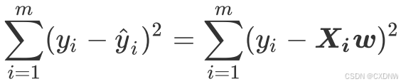

在正式学习机器学习之后，我对我之前的学习笔记产生了相当的不满，它并不具有很好的逻辑性，仅仅只能作为我学习的记录。所以我将对笔记进行整理整合，来呈现一些更具有意思的东西。
# （1）简单概念
机器学习分为监督，半监督，无监督，强化学习。
## 1.1监督学习与无监督学习的区别。

1. 监督学习有标签而无监督没有
2. 监督学习具有预期输出而无监督没有
3. 两者的目标相当不同
4. 两者的用途不同

## 1.2机器学习与深度学习的区别

1. 深度学习是机器学习的一种，两者在基础原理，层级结构，数据需求，性能，应用上具有区别
2. 深度学习较机器学习更为复杂，故需要的计算量也相差较大。
   
## 1.3神经网络
1. 神经网络：在神经网络中，每个神经元都有一个与之关联的权重和偏置，它们用于计算神经元的输出值。神经元接收来自上一层神经元的输入，并将这些输入与权重相乘并加上偏置，然后通过激活函数进行非线性处理，最终产生输出值。（之所以叫这个名字是因为像神经系统对吧）
2. 神经网络的整体架构分别为输入层，隐藏层，输出层。
3. 神经网络有很多分支，如；卷积神经网络，残差网络……
   
## 1.4数据集
1. 数据的类型
   数据有两种类型：
   1.特征值+目标值
   2.只有特征值，没有目标值

2. 数据分割：
一般数据集分为两个部分1.训练数据，2.测试数据。一般训练集会多于测试集。

3. 数据基本处理：即对数据进行缺失值，异常值的处理。从而得到更规范的数据集。

4. 特征工程：指使用专业背景知识和技术处理数据，使得特征能在机器学习算法上发挥更好的作用的过程。
“特征与数据决定了机器学习的上限，而算法和模型只是逼近这个上限而已。”——by吴恩达
5. 特征提取：将任意数据转换为机器学习的数字特征。
6. 特征预处理：通过一些转换函数将特征转化为更加适合算法模型的特征数据过程。
7. 特征降维：指在某些条件下，降低随机变量的个数，得到一组“不相关”主变量的过程

## 1.5机器学习的算法归类
1. 监督学习
   输入数据由输入特征值和目标值组成
   ——函数的输出可以是一个连续的值（回归）
   ——也可以是有限个离散值（分类）

回归问题：
例：预测房价，根据样本拟合出一条连续曲线

分类问题：
例：根据肿瘤特性判断其性质，这是离散的

2. 无监督学习
   输入数据由特征值组成，没有目标值
    ——输入数据没有被标记，也没有确定的结果，样本数据类别未知
    ——需要样本间的相似性对样本集进行类别划分。

3. 半监督学习
   即训练集同时包含有标记样本数据和未标记样本数据

4. 强化学习
   即自动进行决策，并可以连续做出决策。

## 1.6模型评估
1.分类模型评估，主要评估准则为准确率。
2.回归模型评估：均方根误差（RMSE）
3.拟合用于评价模型的表现效果，主要分为过拟合和欠拟合
欠拟合指模型过于粗糙
过拟合指模型表现过于优越，但在测试中表现不佳

## 1.7激活函数
1. 让多层感知机成为真正的多层，否则等价于一层。
2. 引入非线性，使网络可以逼近任意非线性函数————万能逼近定理。
   激活函数的必备性质：
   1.连续且可导（允许少数点上不可导），以便于利用数值优化的方式来学习网络参数。
   2.激活函数和其导函数要尽可能简单，以提高网络计算效率。
   3激活函数的导函数的值域要在合适区间内，不能太大也不能太小，以保证训练的效率和稳定性
   常见的激活函数：Sigmoid(S型），tanh（双曲正切），ReLU（修正线性单元）

## 1.8损失函数
1. 损失函数主要针对单样本，而代价函数是考虑总体的差异值。那么优化Loss和优化Cost其实区别不大。
2. 目标函数= Cost+Regularzathion Term (正则项，用于控制复杂度，防止过拟合)
   目标函数则强调整个训练过程。
3. 常见的损失函数
   (1).MSE（均方误差），输出与标签之差的平方的均值，常在回归任务中使用。
   (2).CE（交叉熵），源于信息论，用于权衡两个分布的差异，常在分类任务中使用。 了解交叉熵需要先了解信息熵和自信息
   信息熵：描述信息的不确定度，它是所有可能取之的信息量的期望。
   自信息：l（x）=-logP(x),P(x)是某事件发生的概率。
   相对熵：又称K-L散度，用于衡量两个分布间的差异。
   交叉熵=信息熵+相对熵，故优化交叉熵等价于优化相对熵，因为信息熵是一个常数。
   交叉熵的好朋友— Softmax 函数：它可以将数据变换到符合概率分布的形式

## 1.9归纳偏好
1. 归纳偏好：机器学习在算法中对某种假设类型的偏好。如在预测西瓜的好坏中提供三个特征：色泽，排击声音，根蒂形状，且认为三个特征“等效”。此时模型可能对某个特征产生偏好。任何有效的机器学习都有其归纳偏好，否则它可能被训练集上“等效的”特征迷惑，从而无法产生确定的学习结果。归纳偏好可以看作算法自身在一个很庞大的假设空间中对假设进行选择的启发式或称之为“价值观”。
2. 既然归纳偏好这么重要，那么有没有一般性的原则来引导算法建立正确的偏好呢？奥卡姆剃刀是一种常用的，自然科学研究中最基本的原则，即“若有多个假设与观察一致，则选取最简单的那个。”但是，奥卡姆剃刀并非唯一的可行原则。并且，奥卡姆剃刀本身存在不同的诠释。在机器学习中，算法的归纳偏好是否与问题本身匹配在大多数时候直接决定了算法能否取得好的性能。那么接下来又引入一个概念，即“没有免费的午餐定理”（NFL），它的内容是“针对同一个玩意儿，无论算法有多么聪明，他们的期望性能实际上是一样的。

# （2）机器学习
这部分的笔记是我在速通吴恩达机器学习前40集后我再来完成的，所以我想要在这里加入更多的我自己的语言，而不是简单地 copy 。这里主要做简单总结，同时也相当于进行一个简单的复习

## 1.线性回归
回归是一种用于预测的技术，回归的关键在于预测的结果是连续变量。
在视频中我们首先讨论了简单的关于一个变量的回归，而后讨论了多元线性回归。
### 1.1多元回归
多元线性回归指的是一个样本有多个特征的线性回归问题。对于一个有n个特征样本而言，他的回归方程大致可表示为

而后，我们可以用矩阵来表示它
线性回归的任务就是构造一个预测函数来映射输入的特征矩阵X和标签y的线性关系。这个 预测函数的本质就是需要构建的模型，而构造预测函数的核心就是找出模型的参数向量 w。

### 1.2loos

我们得到一个回归方程后，就需要判断它的准确度

我们需要令loss尽可能地小，即表示我们的函数与实际情况更加吻合。

### 1.3梯度下降

不论是在线性回归还是 Logistic 回归中，梯度下降的主要目的是通过迭代找到目标函数的最小值，或者收敛到最小值。
在梯度下降中，我们的目的就是找到函数的最小值，

比如在这个碗状的函数中，我们将从亮色的部分逐渐向冷色部分下降
梯度下降的更新公式：θt+1​=θt−η∇θJ(θ)
我们使用更新公式不断更新我们的w与b值，从而使我们的函数有更好的表现。
实际情况中，我们更倾向于使用随机梯度下降（下者)

随机梯度下降的代码实现如下图

### 1.4特征缩放

在某个样本中，我们有多个特征，但是可能x1的值远大于x2，x3等等特征的值，所以此时我们需要合理地分配我们的w1，w2，w3的大小使得函数更加合理
常见的特征缩放方法是标准化,归一化。视频中只讲解了归一化，他的公式如下：

### 1.5拟合

我们训练后得到的函数对于样本可能出现三种情况：1.欠拟合 2.刚刚好 3.过拟合
对于欠拟合，即函数本身可能并不符合情况，甚至无法拟合训练集。
对于过拟合，函数则过分与训练集吻合，如一个本应单调递增的模型，函数出现了波动，以无限贴合训练集，最后在测试集中表现不佳。

### 1.6正则化

我们采用正则化的方式防止函数过拟合
正则化即在梯度下降的方程中添加一个关于lambda 的函数以对梯度下降进行惩罚。

# 后面很多东西（函数以及他的推导）我是手写的，大概有个二十页，这里来不及用markdown呈现了😭还望高抬贵手让我在面试的时候展现一下